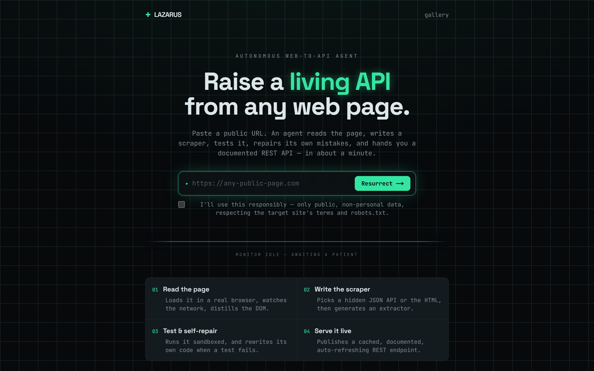
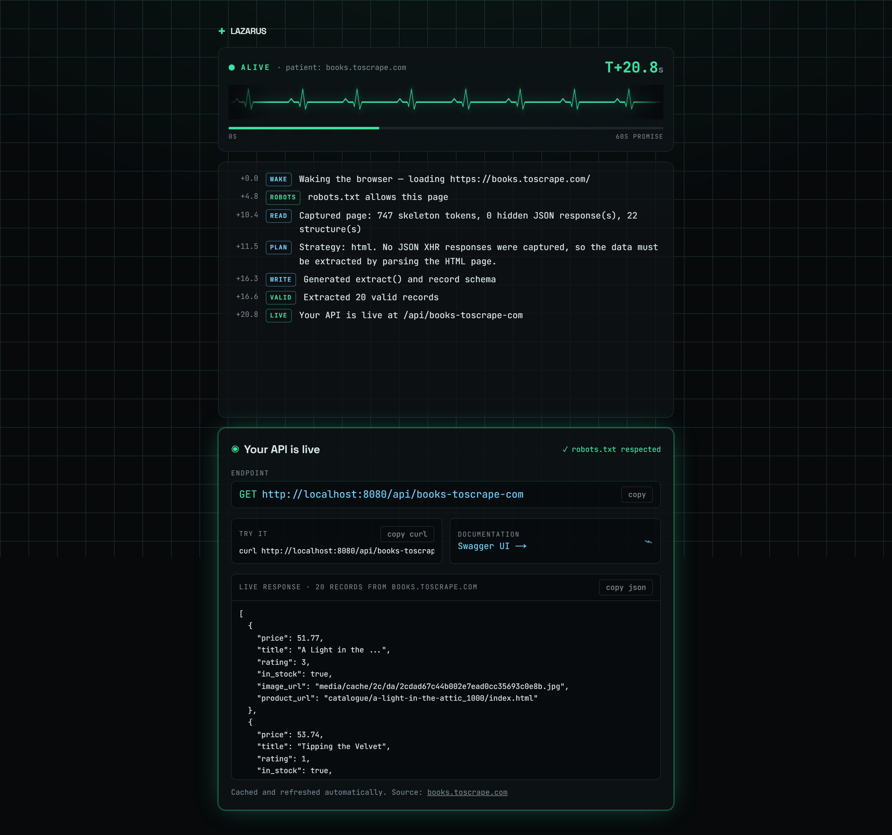
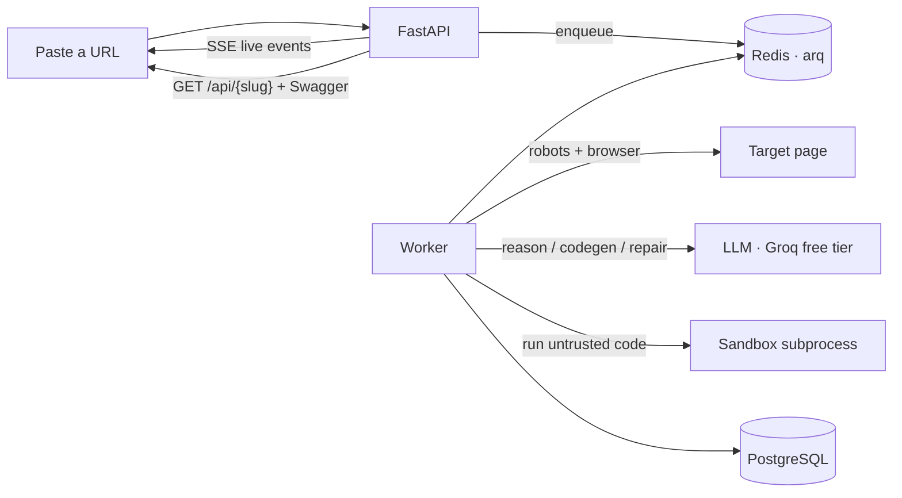

# Lazarus

**Paste any public URL → get a working, documented, live REST API for that page's data in about a minute.**

An autonomous agent loads the page in a real browser, finds a hidden JSON API or reads the HTML, generates a scraper, runs it in a sandbox, **repairs its own code when a test fails**, and publishes a cached, auto-refreshing, documented endpoint — streaming its reasoning to a live "vital signs" monitor while it works.

Everything runs on a single 4GB VPS. The only bill is the VPS; the LLM runs on a free tier.

> Status: **Phases 1–4 complete.** Full architecture in [docs/ARCHITECTURE.md](docs/ARCHITECTURE.md).

<p align="center">
  
</p>

### A real run, start to finish

Below is an actual run against `books.toscrape.com`: the agent wakes a browser, checks robots.txt, reads the page, writes and validates an extractor, and publishes a live endpoint in ~20 seconds — every step streamed to the monitor, ending with the working API and its live JSON response.

<p align="center">
  
</p>

## What it does, end to end



1. **Read** — Playwright loads the page, records hidden JSON/XHR responses, and distills the DOM into a compact skeleton.
2. **Write** — the agent picks a strategy (hidden JSON API vs. HTML) and generates a single pure `extract()` function plus a record schema.
3. **Test & self-repair** — the code runs in a locked-down subprocess; on any failure the error is fed back and the model rewrites its own code, up to 4 times.
4. **Serve** — a successful run becomes `GET /api/{slug}`, served from a Postgres cache, documented with per-endpoint OpenAPI 3.1 + Swagger UI, and refreshed on a schedule.

### How the self-repair loop works

The loop never trusts the model's first answer. Each generated extractor is executed against the real page data and validated against its own declared schema. A failure — a sandbox error, an empty result, a wrong field type — is turned into a plain-language message and sent back with the previous code:

```
strategy → codegen → sandbox → validate ─ ok ─→ persist as a live API
                        ▲                  │
                        └──── repair ◀── fail (≤ 4 times)
```

Real failures it recovers from live: the model inventing a BeautifulSoup-style selector API (corrected by an API cheat-sheet in the repair prompt), marking an optional field as required (relaxed on the next pass), or an exception on messy data. Watch it happen in the live event stream — the actual error is shown, then the fix.

## Run it locally

```bash
cp .env.example deploy/.env     # set LAZARUS_USER_AGENT and GROQ_API_KEY (free: console.groq.com)
make dev                        # docker compose up --build
```

- App (via Caddy): http://localhost:8080
- No `make`? `docker compose -f deploy/docker-compose.yml up --build`

Or run the agent from the terminal without the full stack (needs an LLM key + Chromium, no Postgres/Redis):

```bash
cd backend && .venv/Scripts/python -m app.cli https://books.toscrape.com/
```

## Deploy

```bash
cd deploy && ./deploy.sh        # git pull → build → migrate → health check
# nightly backup (VPS crontab):  0 3 * * *  /path/to/lazarus/deploy/backup.sh
```

Caddy terminates TLS (Let's Encrypt) on `LAZARUS_DOMAIN` and routes `/api`, `/jobs`, `/healthz` to the API and everything else to the Next.js frontend.

## Tests

```bash
cd backend
python -m venv .venv && .venv/Scripts/pip install -r requirements-dev.txt
.venv/Scripts/python -m pytest                    # unit (fast, no browser)
.venv/Scripts/python -m playwright install chromium
.venv/Scripts/python -m pytest -m integration     # sandbox escapes + real-browser capture
.venv/Scripts/python -m ruff check .
```

## Responsible scraping

Public, non-authenticated pages only. Lazarus respects `robots.txt` (and refuses when the rules can't be read), throttles to 1 request/second per domain, sends an honest identifying User-Agent, blocks private/internal network targets (plus an operator denylist), and requires a responsible-use acknowledgement on every job. Job creation is rate-limited per IP and globally, and at most 20 public APIs stay live at once (least-recently-used are evicted). Every API attributes its source URL.

## Honest limitations

- **The in-process import guard is a speed-bump, not a jail.** The real isolation is OS-level: a separate killable subprocess with no-fork / no-file-write / memory / CPU resource limits, and a no-egress container in production. A determined attacker can defeat any in-process Python sandbox; Lazarus is built to run *its own* generated code safely, not hostile code.
- **Free-tier LLMs churn.** The default model is one env var precisely because providers deprecate models without notice (the original default was decommissioned mid-build).
- **Best on list/grid pages.** It shines on catalogs, feeds, and tables; heavily interactive or auth-gated pages are out of scope by design.
- **Small scale.** One 4GB VPS, two concurrent browsers, 20 live APIs — this is a portfolio demonstration, not a production scraping platform.

## Stack

FastAPI · SQLAlchemy 2 + Alembic · Pydantic v2 · Redis + arq · Playwright (Chromium) · PostgreSQL 16 · Next.js 14 + Tailwind · Server-Sent Events · Caddy · Docker Compose · GitHub Actions.
