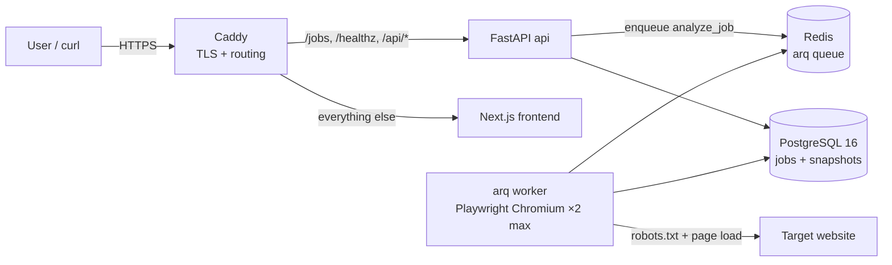

# Lazarus — Architecture

Autonomous agent that turns any public website URL into a working, documented REST API in ~60 seconds. Runs entirely on one 4GB VPS; the only runtime dependency with a bill attached is the VPS itself (LLM calls use free tiers).

**Status: Phase 1 complete** — foundation and ingestion engine. No LLM yet.

## System overview



All six containers run from one Docker Compose file; `deploy/docker-compose.prod.yml` overlays production settings (TLS, memory limits, restart policies).

## Components

| Container | Image base | Role | Prod memory cap |
|---|---|---|---|
| `caddy` | caddy:2-alpine | TLS (Let's Encrypt), reverse proxy | ~40MB (unlimited) |
| `api` | python:3.12-slim | FastAPI: job submission/status, health | 512MB |
| `worker` | python:3.12-slim + Chromium | arq consumer: the ingestion pipeline | 1536MB |
| `frontend` | node:20-alpine | Next.js 14 UI (placeholder until Phase 4) | 384MB |
| `postgres` | postgres:16-alpine | Jobs, page snapshots, (later) extractors | 512MB |
| `redis` | redis:7-alpine | arq job queue, per-domain rate locks | 320MB |

Total caps ≈ 3.3GB against 4GB RAM, leaving headroom for the kernel and page cache. The worker is the hog: `max_jobs = 2` bounds concurrent Chromium instances.

## Job lifecycle (Phase 1)

```
queued ──► analyzing ──► done
   │            └──────► failed  (reason stored on the job)
   └───────────────────► failed
```

Transitions are enforced by `app/job_states.py`; anything else raises `InvalidTransition`. `done` and `failed` are terminal.

## Ingestion pipeline (`app/worker.py::analyze_job`)

1. **URL guard** (`ingestion/urlguard.py`) — http(s) only; rejects localhost, private/link-local/reserved IPs, both as literals and after DNS resolution. The API route runs the syntactic checks at submit time; the worker re-validates with real DNS. (Network-layer SSRF hardening lands in Phase 3.)
2. **robots.txt** (`ingestion/robots.py`) — fetched and parsed with `protego` (wildcard-correct). Disallowed → job fails with the human-readable reason. 404 → allowed by convention. 5xx/429/network failure → conservatively refused.
3. **Per-domain throttle** — Redis `SET NX PX 1000`: at most 1 request/second to any target domain, shared across workers.
4. **Capture** (`ingestion/capture.py`) — Playwright Chromium, headless, `--disable-dev-shm-usage`, honest User-Agent. Blocks image/media/font requests. Records every XHR/fetch response that is (or sniffs as) JSON — capped at 30 responses × 200KB. These hidden JSON APIs are the preferred extraction source in Phase 2.
5. **Distillation** (`ingestion/distill.py`) — one parse (selectolax), three outputs:
   - *skeleton*: scripts/styles/svg/comments/base64 stripped, kept attributes whitelisted, long text truncated, ≥4 identical-signature siblings collapsed to 2 samples + `<!-- +N more div.card -->`. Rendered under a token budget (default 8K) with a tighter profile retry, then hard truncation.
   - *structures*: `<table>` (columns + row count) and repeated-pattern detection (cards, list items).
   - *meta*: title, description, OpenGraph/Twitter tags.
6. **Persist** — `PageSnapshot` row (full HTML capped at 2MB, skeleton, XHR log, structures, meta, robots verdict), job → `done`.

Any exception fails the job with the error message stored — nothing crashes the worker loop.

## Design decisions worth defending in an interview

- **No `networkidle`.** Playwright's own docs discourage it; long-polling/analytics keep it from ever firing. Instead: `domcontentloaded`, then wait for the network to stay quiet for 1.5s inside a hard 15s budget, then proceed with whatever loaded. Degrades gracefully instead of timing out.
- **Conservative robots policy.** If we can't read the rules (5xx/timeout), we refuse rather than assume permission. A 404 means "no rules published" and is allowed, per long-standing convention.
- **XHR capture before HTML parsing.** Many sites ship an empty shell and hydrate from JSON endpoints. Those endpoints are more stable than DOM structure, cheaper to parse, and make a better demo ("found the hidden API").
- **Fakes-by-ctx in the worker.** `analyze_job` reads its external stages (DNS, robots fetch, browser) from the arq `ctx` dict with real defaults; tests override keys. No mocking framework, no patching.
- **Browser-per-job, two jobs max.** Launching Chromium per capture costs ~400ms but guarantees memory is fully returned. Context pooling/recycling is a Phase 3 optimization if throughput demands it.
- **DB-portable models.** `sa.JSON().with_variant(JSONB)` and `sa.Uuid` run on SQLite (unit tests, in-memory, fast) and PostgreSQL (production) without branching.

## Repository layout

```
backend/
  app/
    main.py            FastAPI factory + lifespan wiring
    config.py          pydantic-settings (LAZARUS_* env vars)
    models.py          Job, PageSnapshot
    job_states.py      state machine
    worker.py          arq settings + analyze_job pipeline
    routes/            jobs.py, health.py
    ingestion/         urlguard.py, robots.py, capture.py, distill.py
  alembic/             migrations (0001: jobs + page_snapshots)
  tests/               69 tests; integration marked (needs Chromium)
frontend/              Next.js 14 + Tailwind placeholder
deploy/                docker-compose.yml (+prod overlay), Caddyfiles
docs/                  this file
.github/workflows/     ruff + pytest + integration + docker build
```

## Phase log

- **Phase 1 (done):** monorepo, compose stack, ingestion pipeline (robots → capture → distill → persist), job state machine, jobs API, CI.
- **Phase 2 (next):** LLM client (Groq default / Gemini fallback), strategy selection, scraper codegen, sandboxed execution, self-repair loop, event stream.
- **Phase 3:** dynamic public endpoints, per-extractor OpenAPI docs, refresh scheduling, abuse protection, VPS deployment.
- **Phase 4:** landing page, live agent theater (SSE), gallery, demo mode, portfolio polish.
