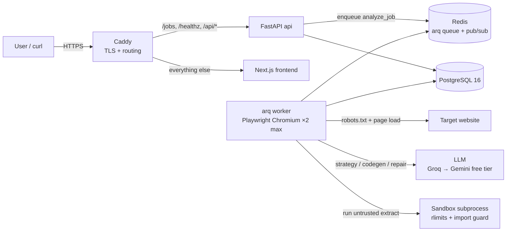
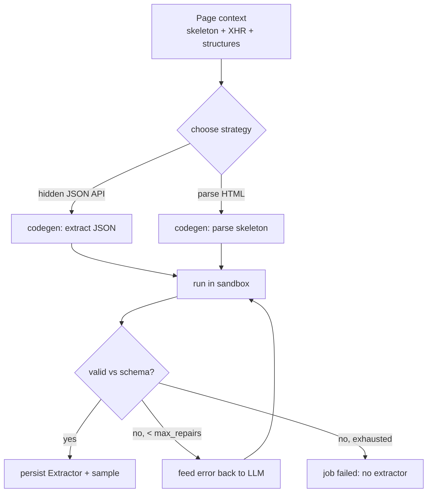

# Lazarus — Architecture

Autonomous agent that turns any public website URL into a working, documented REST API in ~60 seconds. Runs entirely on one 4GB VPS; the only runtime dependency with a bill attached is the VPS itself (LLM calls use free tiers).

**Status: Phase 3 complete** — every successful extraction is now a live, documented, rate-limited public API endpoint with scheduled refresh.

## System overview



All six containers run from one Docker Compose file; `deploy/docker-compose.prod.yml` overlays production settings (TLS, memory limits, restart policies).

## Components

| Container | Image base | Role | Prod memory cap |
|---|---|---|---|
| `caddy` | caddy:2-alpine | TLS (Let's Encrypt), reverse proxy | ~40MB (unlimited) |
| `api` | python:3.12-slim | FastAPI: job submission/status, health | 512MB |
| `worker` | python:3.12-slim + Chromium | arq consumer: ingestion + agent (LLM, sandbox) | 1536MB |
| `frontend` | node:20-alpine | Next.js 14 UI (placeholder until Phase 4) | 384MB |
| `postgres` | postgres:16-alpine | Jobs, snapshots, events, LLM calls, extractors | 512MB |
| `redis` | redis:7-alpine | arq job queue, per-domain rate locks | 320MB |

Total caps ≈ 3.3GB against 4GB RAM, leaving headroom for the kernel and page cache. The worker is the hog: `max_jobs = 2` bounds concurrent Chromium instances.

## Job lifecycle

```
queued ──► analyzing ──► done    (extractor built, or snapshot-only if no LLM configured)
   │            └──────► failed  (robots block, capture crash, or agent gave up — reason stored)
   └───────────────────► failed
```

Transitions are enforced by `app/job_states.py`; anything else raises `InvalidTransition`. `done` and `failed` are terminal. The captured `PageSnapshot` is committed **before** the agent stage runs, so it survives an agent failure for debugging.

## Ingestion pipeline (`app/worker.py::analyze_job`)

1. **URL guard** (`ingestion/urlguard.py`) — http(s) only; rejects localhost, private/link-local/reserved IPs, both as literals and after DNS resolution. The API route runs the syntactic checks at submit time; the worker re-validates with real DNS. (Network-layer SSRF hardening lands in Phase 3.)
2. **robots.txt** (`ingestion/robots.py`) — fetched and parsed with `protego` (wildcard-correct). Disallowed → job fails with the human-readable reason. 404 → allowed by convention. 5xx/429/network failure → conservatively refused.
3. **Per-domain throttle** — Redis `SET NX PX 1000`: at most 1 request/second to any target domain, shared across workers.
4. **Capture** (`ingestion/capture.py`) — Playwright Chromium, headless, `--disable-dev-shm-usage`, honest User-Agent. Blocks image/media/font requests. Records every XHR/fetch response that is (or sniffs as) JSON — capped at 30 responses × 200KB. These hidden JSON APIs are the preferred extraction source in Phase 2.
5. **Distillation** (`ingestion/distill.py`) — one parse (selectolax), three outputs:
   - *skeleton*: scripts/styles/svg/comments/base64 stripped, kept attributes whitelisted, long text truncated, ≥4 identical-signature siblings collapsed to 2 samples + `<!-- +N more div.card -->`. Rendered under a token budget (default 8K) with a tighter profile retry, then hard truncation.
   - *structures*: `<table>` (columns + row count) and repeated-pattern detection (cards, list items).
   - *meta*: title, description, OpenGraph/Twitter tags.
6. **Persist snapshot** — `PageSnapshot` row (full HTML capped at 2MB, skeleton, XHR log, structures, meta, robots verdict), committed immediately.
7. **Agent stage** (Phase 2, below) — only if an LLM key is configured; otherwise the job stops here as `done`.

Any exception fails the job with the error message stored — nothing crashes the worker loop.

## Agent stage (`app/agent/`)

The autonomous core takes the snapshot and produces a validated `extract()` function. It is provider/sandbox-agnostic — `AgentLoop` depends only on an object with `.complete()`, an emitter with `.emit()`, and a sandbox callable — so every step is unit-tested with fakes (no real LLM, browser, or subprocess).



1. **Strategy** (`agent/prompts.py`, `agent/loop.py`) — the model picks `json_xhr` (a captured hidden API returns the list data) or `html` (parse the skeleton). A hallucinated XHR URL we never captured is rejected and falls back to HTML.
2. **Codegen** — the model returns `{"code", "schema"}`: one pure `extract(html_or_response) -> list[dict]` plus a field schema. `agent/parsing.py` pulls the JSON out of whatever prose/fences the model wraps it in.
3. **Sandbox** (`app/sandbox/`) — the untrusted code runs in a **separate, killable subprocess** (`python -m app.sandbox.child`), never in the worker. See the sandbox section below.
4. **Validation** (`agent/validation.py`) — output is checked against a pydantic model built from the schema: non-empty, every record valid, required fields covered.
5. **Self-repair** — on any failure (sandbox error or invalid output) the error is fed back with the previous code; up to `max_repairs` (default 4) iterations. Each step emits a structured event.
6. **Persist** — a successful run stores a versioned `Extractor` (slug, source URL, strategy, code, schema, sample records); every prompt/response is logged to `llm_calls` for the "watch it think" UI and cost tracking, even on failure.

### LLM client (`app/llm/`)

- **Provider-agnostic** over the OpenAI-compatible chat-completions dialect. Groq (`/openai/v1`) is the default, Google Gemini (`/v1beta/openai`) the fallback; both use Bearer auth. Order is set by `LAZARUS_LLM_PROVIDER`, and only providers with a key present are tried (`build_providers`).
- **Free-tier discipline**: default model is `openai/gpt-oss-120b` (1K req/day, 8K TPM; picked after `llama-4-scout` was decommissioned mid-project — free models churn, which is exactly why the model is one env var). A stable system-prompt prefix is reused verbatim so Groq's prompt cache (which doesn't count against the free tier) absorbs it.
- **Per-job token budget** (`llm/budget.py`, default 60K) is charged on every call and blocks a runaway repair loop from draining the daily quota.
- **Resilience**: 429/5xx retried with exponential backoff, then fall through to the next provider; `AllProvidersFailed` only when everyone is exhausted.

### Sandbox (`app/sandbox/`) — defence in depth

The extractor is attacker-controlled (an LLM wrote it against a live site). Isolation, weakest layer to strongest:

1. **Import guard** — a *blocklist* (not a whitelist): denies the network / subprocess / native-code / filesystem roots. selectolax is Cython-built and transitively imports large swathes of the stdlib (`typing → collections → sys`, `logging → os/threading`), so a whitelist is unworkable. This stops naive escapes; it is explicitly **not** a hard boundary (in-process Python sandboxes are bypassable via object-graph gadgets). `builtins.open` is also neutralised.
2. **POSIX resource limits** (Linux worker, via `preexec_fn`) — the real teeth: `RLIMIT_NPROC=0` (no fork → no fork bomb), `RLIMIT_FSIZE=0` (no file bytes written), plus address-space and CPU-second caps. The CPU cap sits *above* the wall clock so the wall-clock timeout wins deterministically.
3. **Separate process + hard wall-clock timeout** enforced by the parent; the subprocess is killed on timeout and takes nothing else down. The blocking `subprocess.run` is offloaded via `asyncio.to_thread` so the worker's event loop (and the live event stream) stays responsive.

In production the worker container also runs with no network egress — that, not the import guard, is the real network boundary. On Windows dev there are no rlimits, so the import guard + `open` block + wall-clock timeout carry the escape tests.

### Event stream (`app/events.py`)

Every agent step emits one `AgentEvent` (per-job sequence number, kind, message, data). Events are persisted to `job_events` for replay and published to a per-job Redis channel (`lazarus:events:{job_id}`) that the SSE endpoint will subscribe to in Phase 4. The worker uses `EventEmitter` (DB + Redis); the CLI uses a print-only emitter.

### Running it from the terminal

`python -m app.cli <url>` runs the whole pipeline (guard → robots → capture → distill → agent) and streams events to stdout. It needs an LLM key and a Chromium install but **no Postgres or Redis** — ideal for quick local iteration.

## Live API fabric (Phase 3)

### Serving: `GET /api/{slug}`

Each successful extraction registers a readable slug (`/api/books-toscrape-com`). The endpoint serves the **Postgres-cached** result set — a request never triggers a scrape. The envelope carries `data`, `record_count`, `last_refreshed`, `status`, and source attribution. Latest `version` wins when a site is re-analyzed; older versions are marked `superseded` and kept for history.

Per-extractor documentation is generated on the fly: `GET /api/{slug}/openapi.json` builds an OpenAPI 3.1 spec from the agent's record schema, a real sample record as the example, and a one-sentence description the LLM wrote at creation time (`purpose="describe"`, one cheap call, falls back to a template). `GET /api/{slug}/docs` serves Swagger UI over that spec.

### Refresh: stale-while-revalidate

An arq cron scans every 5 minutes for active extractors past their `refresh_interval_minutes` (default 30) and enqueues one refresh job each, so `max_jobs = 2` bounds Chromium during refreshes too. A refresh re-runs the full guard chain (SSRF check, robots.txt, 1 req/s domain throttle), re-captures the page, executes the **stored** code in the sandbox, and validates against the stored schema. For `json_xhr` extractors the stored hidden-API URL is re-matched in the fresh capture — exact URL first, then host+path (query strings often carry timestamps).

Cached data is only replaced on success. Each failure increments a strike counter; the **third consecutive strike pauses** the extractor with the reason stored. A paused endpoint keeps serving its last good data, clearly marked `status: paused`. Lifecycle:

```
active ──3 failed refreshes──► paused    (still served, marked stale)
active ──new version built───► superseded (history only)
active ──over the LRU cap────► evicted   (410 Gone)
```

### Abuse protection

- **Responsible-use token**: `POST /jobs` requires `responsible_use: true` (the UI's checkbox); refused with a clear 422 otherwise.
- **Rate limits**: fixed one-hour Redis windows — 3 jobs/hour per IP and 30/hour globally (the global cap is what actually protects the free LLM quota). 429 with a human-readable reason.
- **Active cap with LRU eviction**: at most 20 live APIs; creating one beyond the cap evicts the least recently *accessed* (410 afterwards).
- **SSRF denylist**: beyond the built-in private/link-local/reserved-IP blocks (checked pre- and post-DNS), `LAZARUS_DENY_HOSTS` lists the operator's own hostname/IP so Lazarus can never be pointed at itself.

### Deployment

`deploy/deploy.sh` is the one-command deploy (git pull → compose build/up → health check; migrations run in the api container's start command). `deploy/backup.sh` is a nightly `pg_dump` keeping 14 days, meant for the VPS crontab. Caddy routes `/api/*`, `/jobs*`, `/healthz` to FastAPI and everything else to the frontend, with Let's Encrypt TLS on `LAZARUS_DOMAIN`.

## Design decisions worth defending in an interview

- **No `networkidle`.** Playwright's own docs discourage it; long-polling/analytics keep it from ever firing. Instead: `domcontentloaded`, then wait for the network to stay quiet for 1.5s inside a hard 15s budget, then proceed with whatever loaded. Degrades gracefully instead of timing out.
- **Conservative robots policy.** If we can't read the rules (5xx/timeout), we refuse rather than assume permission. A 404 means "no rules published" and is allowed, per long-standing convention.
- **XHR capture before HTML parsing.** Many sites ship an empty shell and hydrate from JSON endpoints. Those endpoints are more stable than DOM structure, cheaper to parse, and make a better demo ("found the hidden API").
- **Fakes-by-ctx in the worker.** `analyze_job` reads its external stages (DNS, robots fetch, browser) from the arq `ctx` dict with real defaults; tests override keys. No mocking framework, no patching.
- **Browser-per-job, two jobs max.** Launching Chromium per capture costs ~400ms but guarantees memory is fully returned. Context pooling/recycling is a Phase 3 optimization if throughput demands it.
- **DB-portable models.** `sa.JSON().with_variant(JSONB)` and `sa.Uuid` run on SQLite (unit tests, in-memory, fast) and PostgreSQL (production) without branching.
- **Blocklist, not whitelist, in the sandbox.** A whitelist can't survive selectolax's Cython import chain; the honest position is that the import guard is a speed-bump and the OS-level rlimits + no-egress container are the real boundary. Documented rather than papered over.
- **Snapshot committed before the agent runs.** The expensive, flaky part (LLM + repair loop) can't lose the captured page. Events and LLM-call logs land in their own transactions so a crash mid-repair still leaves a full audit trail.
- **Token budget over trust.** A per-job cap makes a misbehaving repair loop fail fast instead of silently burning the day's free quota.

## Repository layout

```
backend/
  app/
    main.py            FastAPI factory + lifespan wiring
    config.py          pydantic-settings (LAZARUS_* env vars)
    models.py          Job, PageSnapshot, JobEvent, LLMCall, Extractor
    job_states.py      state machine
    events.py          AgentEvent + EventEmitter (DB + Redis pub/sub)
    ratelimit.py       per-IP + global job-creation limits (Redis windows)
    openapi_gen.py     per-extractor OpenAPI 3.1 spec builder
    worker.py          arq settings + analyze_job + refresh cron/pipeline
    cli.py             python -m app.cli <url> — run end-to-end from the terminal
    routes/            jobs.py, health.py, public_api.py (GET /api/{slug} + docs)
    ingestion/         urlguard.py, robots.py, capture.py, distill.py
    llm/               budget.py, client.py (Groq → Gemini, OpenAI-compatible)
    agent/             prompts.py, parsing.py, validation.py, loop.py, service.py
    sandbox/           runner.py (parent), child.py (isolated subprocess)
  alembic/             migrations (0001 jobs+snapshots, 0002 agent tables, 0003 fabric)
  tests/               161 tests; integration marked (sandbox escapes + Chromium)
frontend/              Next.js 14 + Tailwind placeholder
deploy/                docker-compose.yml (+prod overlay), Caddyfiles
docs/                  this file
.github/workflows/     ruff + pytest + integration + docker build
```

## Phase log

- **Phase 1 (done):** monorepo, compose stack, ingestion pipeline (robots → capture → distill → persist), job state machine, jobs API, CI.
- **Phase 2 (done):** LLM client (Groq default / Gemini fallback, token budget, backoff), strategy selection, scraper codegen, sandboxed execution (rlimits + import guard), self-repair loop (≤4), event stream (DB + Redis pub/sub), CLI runner. Live-verified 5/5 real sites.
- **Phase 3 (done):** `GET /api/{slug}` served from Postgres cache, per-extractor OpenAPI 3.1 + Swagger UI, scheduled stale-while-revalidate refresh with 3-strike auto-pause, versioning with supersede, abuse protection (responsible-use token, per-IP + global rate limits, LRU cap, operator denylist), deploy + backup scripts. VPS bring-up pending.
- **Phase 4:** landing page, live agent theater (SSE), gallery, demo mode, portfolio polish.
